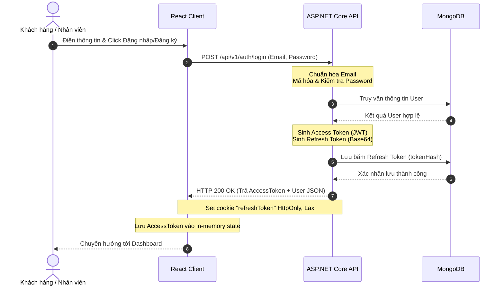
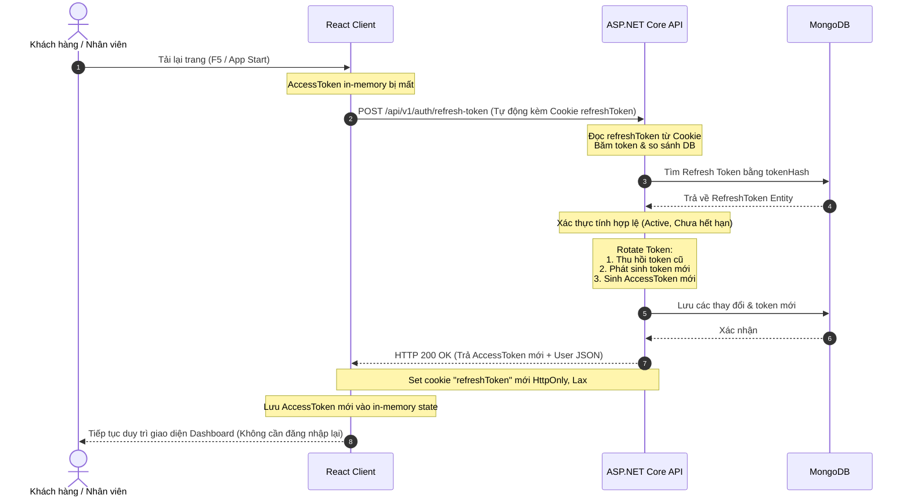
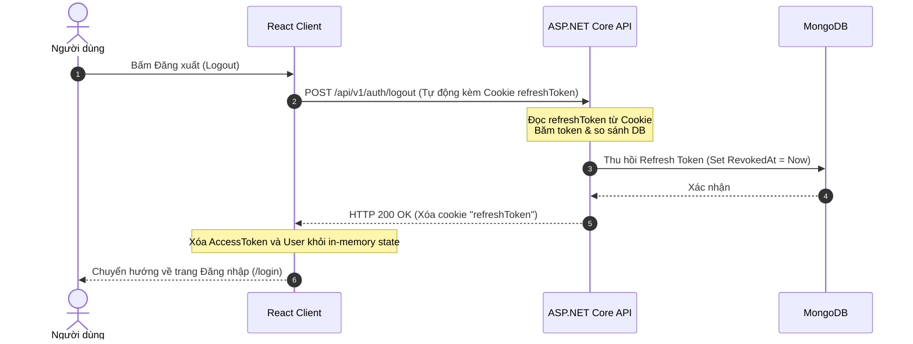

# Authentication Workflows

Tài liệu này chứa sơ đồ biểu diễn các luồng xác thực chính trong hệ thống ServiceFlow.

## 1. Đăng ký & Đăng nhập (Register & Login)

## 2. Tự động gia hạn phiên đăng nhập (Silent Token Refresh)

## 3. Đăng xuất (Logout)

