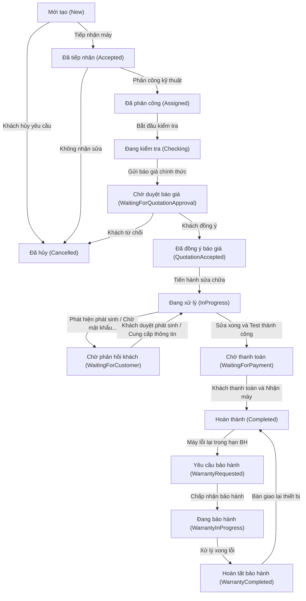

# Quy trình dịch vụ chính (Main Service Workflow) - ServiceFlow

Quy trình dịch vụ của ServiceFlow là một máy trạng thái (State Machine) kiểm soát chặt chẽ vòng đời của một **Phiếu dịch vụ (Service Request)**. Hệ thống đảm bảo mọi bước xử lý từ tiếp nhận đến bảo hành đều minh bạch, lưu vết người thực hiện và có sự đồng thuận của khách hàng.

---

## 1. Biểu đồ trạng thái phiếu dịch vụ (Workflow Diagram)

Dưới đây là biểu đồ Mermaid mô tả toàn bộ vòng đời của một phiếu dịch vụ, bao gồm luồng sửa chữa chính và luồng xử lý bảo hành điện tử:

---

## 2. Ý nghĩa chi tiết các trạng thái (State Definitions)

| Mã trạng thái (Code) | Tên hiển thị (Display Name) | Ý nghĩa nghiệp vụ |
| :--- | :--- | :--- |
| `New` | Mới tạo | Phiếu dịch vụ vừa được tạo (do nhân viên nhập thông tin hoặc khách gửi trực tuyến qua website). |
| `Accepted` | Đã tiếp nhận | Cửa hàng đã kiểm tra thông tin, đồng ý nhận thiết bị và đã bàn giao biên nhận hoặc gửi link theo dõi cho khách. |
| `Assigned` | Đã phân công | Phiếu đã được quản lý giao cho một kỹ thuật viên cụ thể chịu trách nhiệm sửa chữa. |
| `Checking` | Đang kiểm tra | Kỹ thuật viên đang tháo máy, chẩn đoán chi tiết lỗi phần cứng/phần mềm và lập bảng kê linh kiện cần thay thế. |
| `WaitingForQuotationApproval` | Chờ duyệt báo giá | Báo giá chi tiết đã được gửi tới khách hàng qua link bảo mật. Cửa hàng đang chờ khách bấm Xác nhận hoặc Từ chối. |
| `QuotationAccepted` | Đã đồng ý báo giá | Khách hàng đã phê duyệt báo giá trực tuyến. Đây là căn cứ pháp lý để kỹ thuật viên bắt đầu sửa chữa. |
| `InProgress` | Đang xử lý | Kỹ thuật viên đang thực hiện sửa chữa, thay thế linh kiện cho thiết bị. |
| `WaitingForCustomer` | Chờ phản hồi khách | Tạm dừng sửa chữa do phát hiện lỗi phát sinh cần báo giá bổ sung hoặc cần khách hàng cung cấp mật khẩu thiết bị để kiểm tra. |
| `WaitingForPayment` | Chờ thanh toán | Thiết bị đã được sửa xong và test chất lượng ổn định. Đang chờ khách hàng thanh toán chi phí để bàn giao máy. |
| `Completed` | Hoàn thành | Khách hàng đã thanh toán đủ tiền, ký nhận bàn giao thiết bị. Hệ thống kích hoạt thời hạn bảo hành điện tử. |
| `Cancelled` | Đã hủy | Phiếu bị hủy do khách hàng từ chối báo giá, cửa hàng không có linh kiện thay thế hoặc thiết bị lỗi quá nặng không thể sửa chữa. |
| `WarrantyRequested` | Yêu cầu bảo hành | Khách hàng gửi yêu cầu bảo hành đối với thiết bị đã sửa chữa (còn trong hạn bảo hành). |
| `WarrantyInProgress` | Đang bảo hành | Thiết bị bảo hành đang được kỹ thuật viên kiểm tra và khắc phục lỗi miễn phí. |
| `WarrantyCompleted` | Hoàn tất bảo hành | Đã xử lý xong lỗi bảo hành, kiểm tra chất lượng đạt yêu cầu và chờ bàn giao lại máy. |

---

## 3. Ma trận chuyển đổi trạng thái (State Transition Matrix)

Để đảm bảo tính toàn vẹn dữ liệu, các bước chuyển đổi trạng thái phải tuân thủ các quy tắc phân quyền và điều kiện đầu vào dưới đây:

| Trạng thái gốc | Trạng thái đích | Vai trò thực hiện | Điều kiện đầu vào & Hành động hệ thống |
| :--- | :--- | :--- | :--- |
| `New` | `Accepted` | Staff / Owner | Nhân viên kiểm tra thông tin, chụp ảnh thiết bị lúc tiếp nhận (lưu Cloudinary). Hệ thống sinh mã phiếu gửi khách. |
| `New` / `Accepted` | `Cancelled` | Staff / Owner | Khách đổi ý không muốn sửa hoặc cửa hàng từ chối nhận sửa từ đầu. |
| `Accepted` | `Assigned` | Owner / Manager | Chọn và gán kỹ thuật viên chịu trách nhiệm sửa chữa. |
| `Assigned` | `Checking` | Technician | Kỹ thuật viên nhấn nút "Bắt đầu kiểm tra" trên trang quản lý công việc của mình. |
| `Checking` | `WaitingForQuotationApproval` | Technician / Owner | Nhập bảng báo giá chi tiết, upload ảnh lỗi linh kiện (nếu có). Hệ thống cập nhật trạng thái báo giá sang "Chờ duyệt". |
| `WaitingForQuotationApproval` | `QuotationAccepted` | Customer | Khách hàng xem báo giá qua link bảo mật và bấm nút "Xác nhận đồng ý". |
| `WaitingForQuotationApproval` | `Cancelled` | Customer / Staff | Khách hàng từ chối báo giá hoặc cửa hàng trả lại máy vì khách không đồng ý chi phí. Ghi nhận phí kiểm tra (nếu có chính sách). |
| `QuotationAccepted` | `InProgress` | Technician | Kỹ thuật viên nhấn "Bắt đầu sửa chữa". |
| `InProgress` | `WaitingForCustomer` | Technician | Tạo báo giá bổ sung do phát hiện thêm lỗi phát sinh mới, hoặc gửi yêu cầu cung cấp thông tin (mật khẩu máy). |
| `WaitingForCustomer` | `InProgress` | Customer / Staff | Khách xác nhận đồng ý báo giá bổ sung hoặc cung cấp thông tin cần thiết. |
| `InProgress` | `WaitingForPayment` | Technician | Kỹ thuật viên upload ảnh kết quả thiết bị hoạt động bình thường, ghi chú kết quả chạy thử (test) và hoàn thành công việc. |
| `WaitingForPayment` | `Completed` | Owner / Staff | Xác nhận khách thanh toán (Tiền mặt / Chuyển khoản). Tự động kích hoạt thời hạn bảo hành điện tử dựa trên từng dịch vụ đã thực hiện. |
| `Completed` | `WarrantyRequested` | Customer / Staff | Nhận yêu cầu bảo hành từ khách. Hệ thống tự động kiểm tra xem thiết bị còn trong thời hạn bảo hành hợp lệ hay không. |
| `WarrantyRequested` | `WarrantyInProgress` | Owner / Manager | Quản lý phê duyệt yêu cầu bảo hành hợp lệ và chỉ định kỹ thuật viên xử lý. |
| `WarrantyInProgress` | `WarrantyCompleted` | Technician | Sửa chữa xong lỗi phát sinh bảo hành, upload ảnh minh chứng. |
| `WarrantyCompleted` | `Completed` | Staff / Owner | Bàn giao lại máy sạch lỗi cho khách hàng. Trạng thái phiếu quay về "Hoàn thành". |
